# T03: Missió Nginx: Migració d'Alt Rendiment i Arquitectura Lleugera

# 1. Preparació de l’Entorn i Instal·lació
## 1.1 Aturada del servei Apache

Per evitar conflictes de ports (80 i 443), es va procedir a aturar i deshabilitar el servei Apache:

sudo systemctl stop apache2
sudo systemctl disable apache2

## 1.2 Instal·lació de Nginx

Ara, instal·larem el servidor web Nginx mitjançant el gestor de paquets:

sudo apt update
sudo apt install nginx -y

## 1.3 Verificació del servei

Comprovarem que el servei està actiu:

sudo systemctl status nginx

Finalment, es va validar l’accés des del navegador, mostrant correctament la pàgina de benvinguda de Nginx.

# 2. Configuració de Server Blocks (Multidomini)
## 2.1 Estructura de directoris

Reutilitzarem les carpetes existents:

/var/www/nexus

/var/www/academia

Ajustarem els permisos:

sudo chown -R www-data:www-data /var/www/nexus
sudo chown -R www-data:www-data /var/www/academia

## 2.2 Creació de Server Blocks

Crearem dos fitxers de configuració a:

/etc/nginx/sites-available/nexus
/etc/nginx/sites-available/academia

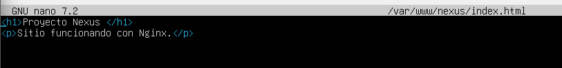

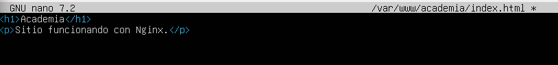

I haurem de fer una petita configuració:

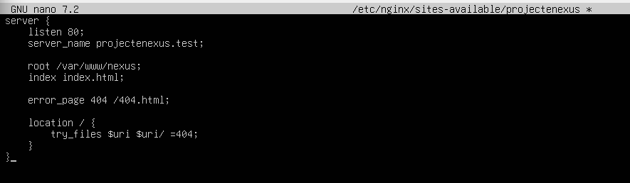

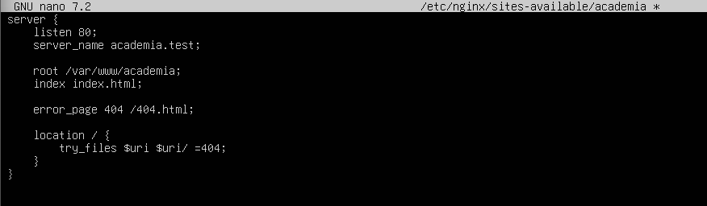

## 2.3 Activació dels llocs

Crearem els enllaços simbòlics:

sudo ln -s /etc/nginx/sites-available/nexus /etc/nginx/sites-enabled/
sudo ln -s /etc/nginx/sites-available/academia /etc/nginx/sites-enabled/

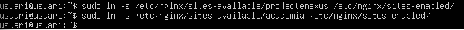

Verificació de la sintaxi, reinici del servei i comprobacio en el client:

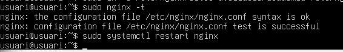

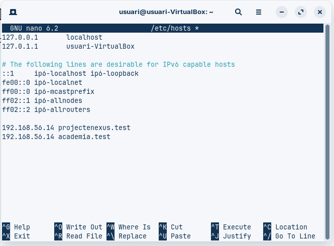

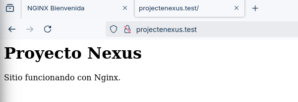

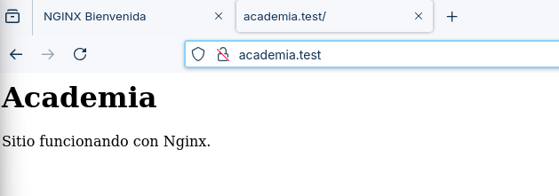

# 3. Personalització d’Errors

Configurararem la gestió d’errors 404 amb la directiva:

error_page 404 /404.html;

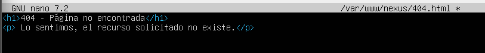

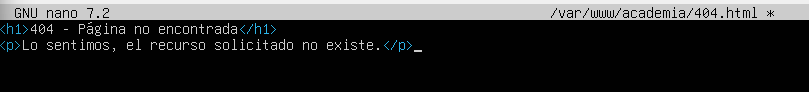

Quan un usuari accedeix a un recurs inexistent, el servidor retorna la pàgina personalitzada prèviament creada, millorant l’experiència d’usuari.

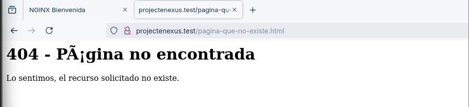

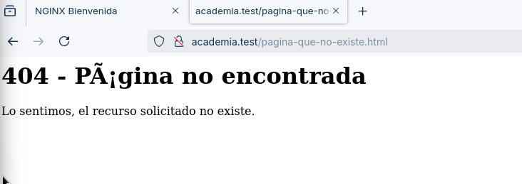

# 4. Seguretat i Certificats (HTTPS)
## 4.1 Generació del certificat SSL

Per habilitar connexions segures, es va generar un certificat SSL autofirmat mitjançant la següent comanda:

sudo openssl req -x509 -nodes -days 365 -newkey rsa:2048 -keyout /etc/ssl/private/projectenexus.key -out /etc/ssl/certs/projectenexus.crt

sudo openssl req -x509 -nodes -days 365 -newkey rsa:2048 -keyout /etc/ssl/private/academia.key -out /etc/ssl/certs/academia.crt

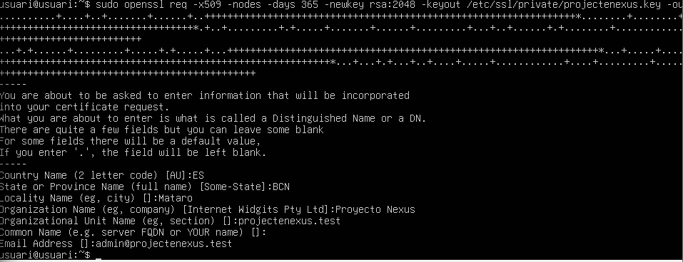

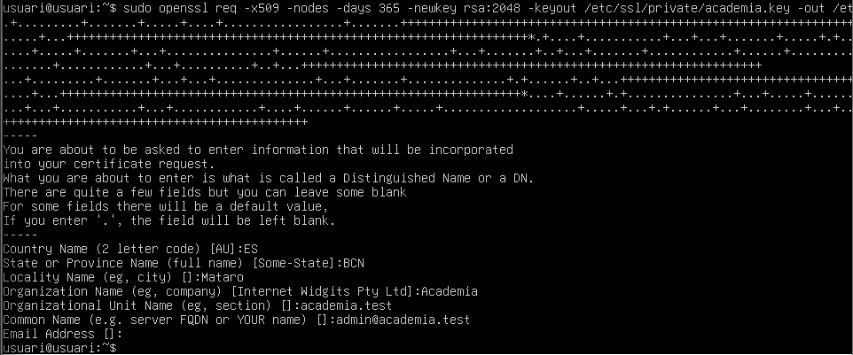

## 4.2 Configuració SSL

Reutilitzarem els certificats SSL existents i es va configurar el servidor per escoltar al port 443:

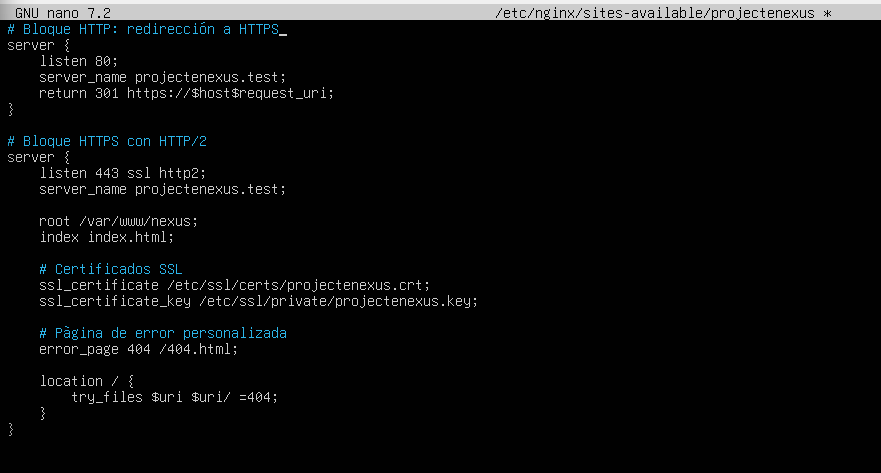

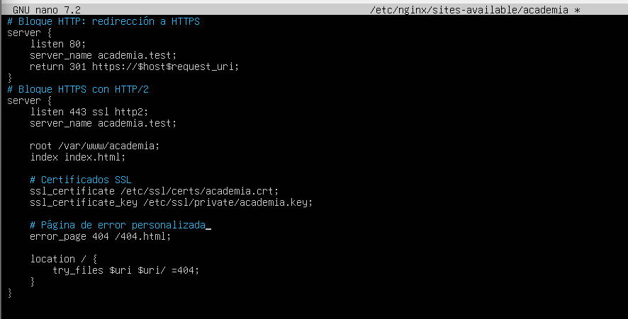

Comprovarem que tot estigui correctament el que hem creat previament:

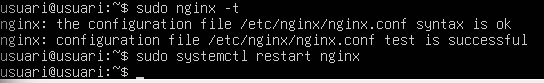

I finalment comprovem que ara funciona via HTTP/2:

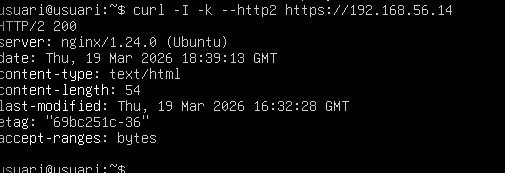

