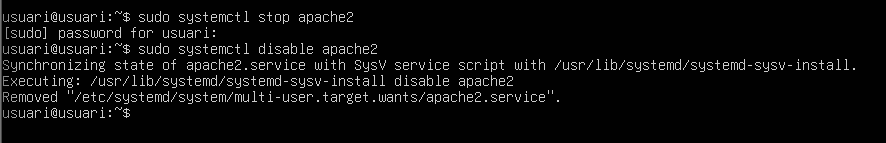
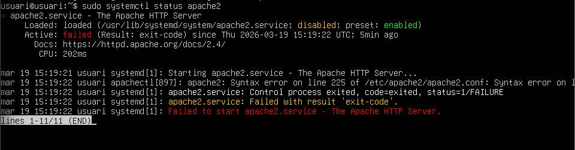
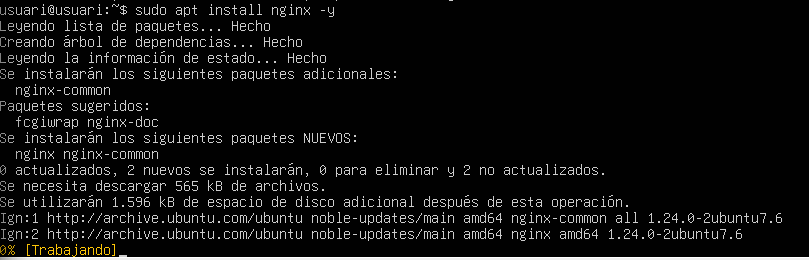
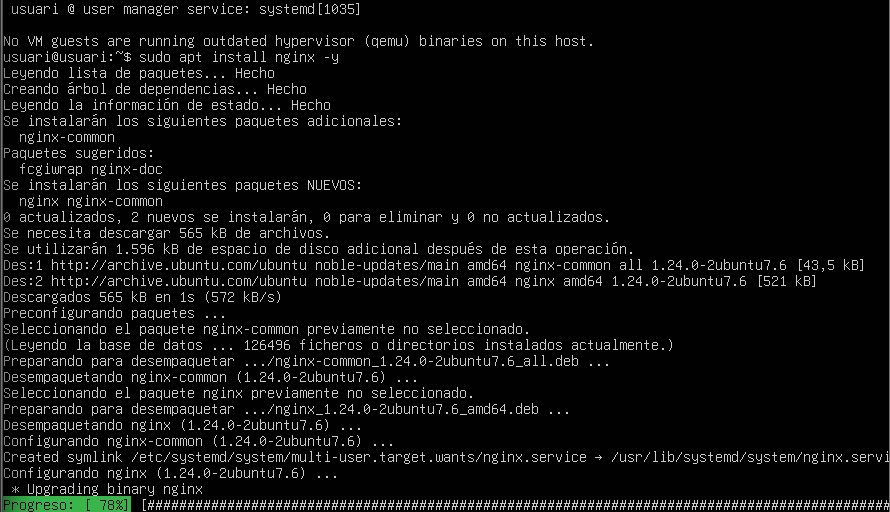
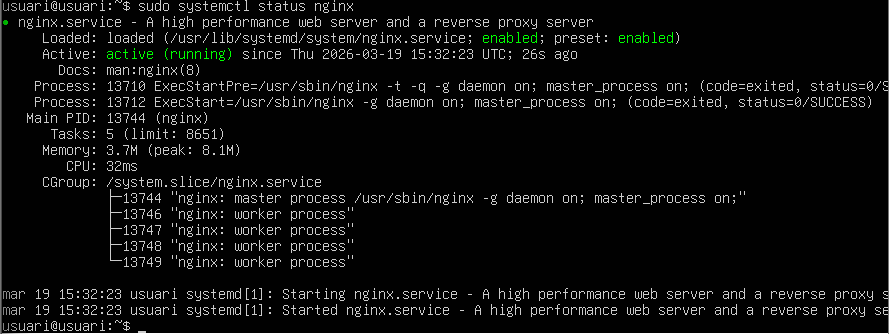
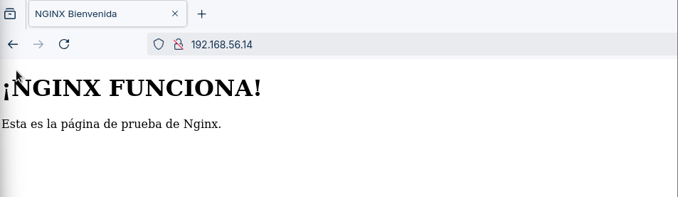
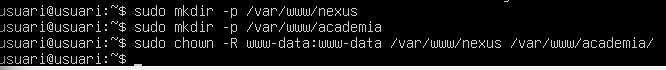

# T03: Missió Nginx: Migració d'Alt Rendiment i Arquitectura Lleugera

# 1. Preparació de l’Entorn i Instal·lació
## 1.1 Aturada del servei Apache

Per evitar conflictes de ports (80 i 443), es va procedir a aturar i deshabilitar el servei Apache:

sudo systemctl stop apache2
sudo systemctl disable apache2

## 1.2 Instal·lació de Nginx

Ara, instal·larem el servidor web Nginx mitjançant el gestor de paquets:

sudo apt update
sudo apt install nginx -y

## 1.3 Verificació del servei

Comprovarem que el servei està actiu:

sudo systemctl status nginx

Finalment, es va validar l’accés des del navegador, mostrant correctament la pàgina de benvinguda de Nginx.

# 2. Configuració de Server Blocks (Multidomini)
## 2.1 Estructura de directoris

Reutilitzarem les carpetes existents:

/var/www/nexus

/var/www/academia

Ajustarem els permisos:

sudo chown -R www-data:www-data /var/www/nexus
sudo chown -R www-data:www-data /var/www/academia

