## Projecte Nexus – T05 Confidencialitat i Integritat de la Informació

---

## 1. Introducció

Projecte Nexus gestiona informació acadèmica sensible, com dades personals d’estudiants, exàmens oficials i certificats de notes. A causa de la importància d’aquesta informació, és necessari aplicar mesures de seguretat que garanteixin la seva protecció.

En aquest informe es presenta una demostració pràctica de dues tècniques fonamentals de la seguretat informàtica:

- Xifratge (Confidencialitat)
- Funcions Hash (Integritat)

---

## 2. Justificació Teòrica

En seguretat informàtica, el xifratge i les funcions hash tenen objectius diferents però complementaris.

El **xifratge** transforma la informació en dades il·legibles mitjançant una contrasenya o clau. Només les persones autoritzades que coneixen la contrasenya poden accedir al contingut original. Aquesta tècnica garanteix la **confidencialitat** de la informació.

En canvi, una **funció hash** genera una empremta digital única d’un fitxer. Si el contingut del fitxer es modifica, encara que sigui mínimament, el valor hash canvia completament. Això permet detectar qualsevol alteració i garanteix la **integritat** del document.

En resum:

- El xifratge protegeix el contingut.
- El hash permet verificar que el contingut no ha estat modificat.

---

# 3. TASCA 1 – Protecció de dades en repòs (Xifratge Simètric)

### Eina utilitzada: VeraCrypt 
### Algorisme utilitzat: AES-256  
### Mida del volum: 100 MB  

---

## 3.1 Creació del volum xifrat

S’ha creat un contenidor xifrat utilitzant el programari VeraCrypt amb les següents característiques:

- Tipus: Volum estàndard
- Mida: 100 MB
- Algorisme de xifratge: AES-256
- Sistema de fitxers: NTFS
- Contrasenya robusta (mínim 16 caràcters amb combinació de majúscules, minúscules, números i símbols)

Aquest volum simula un dispositiu USB utilitzat per transportar exàmens finals de forma segura.

### 📸 Evidència 1 – Configuració del volum

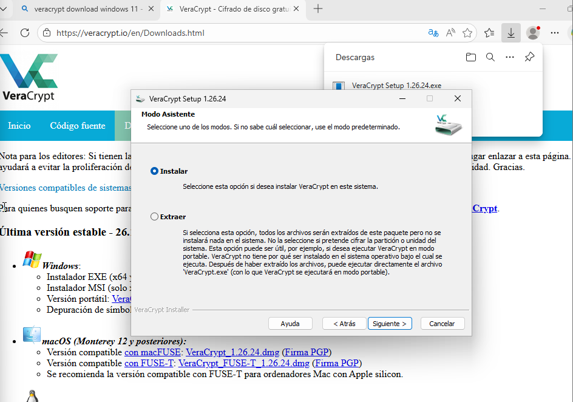
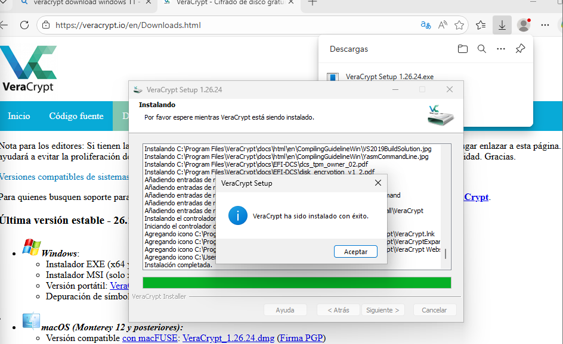
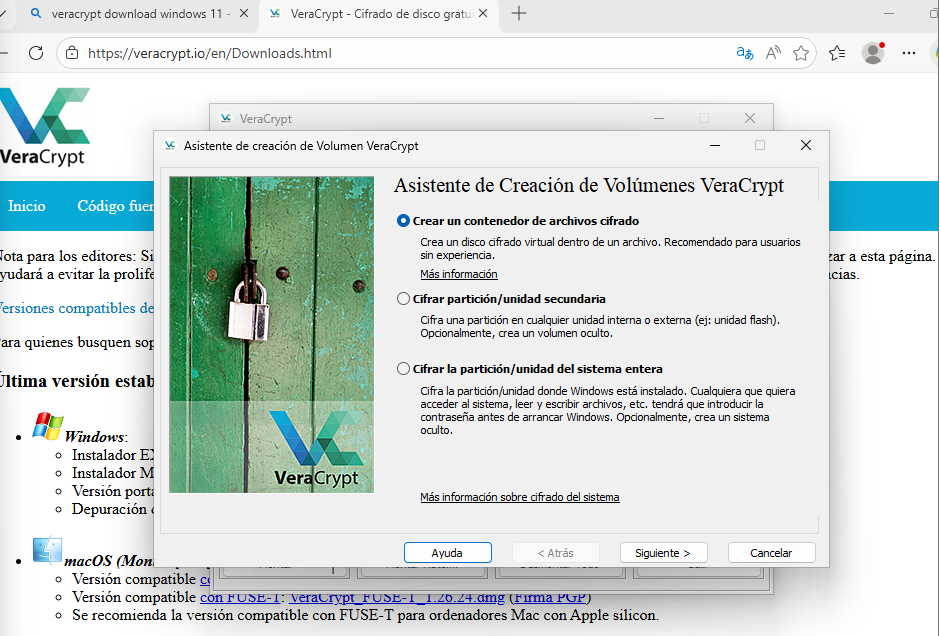
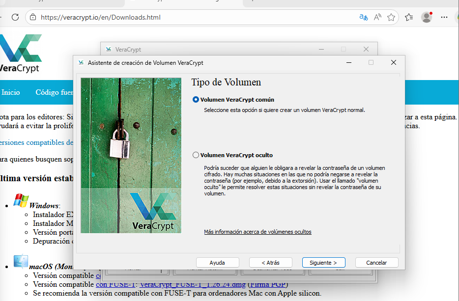
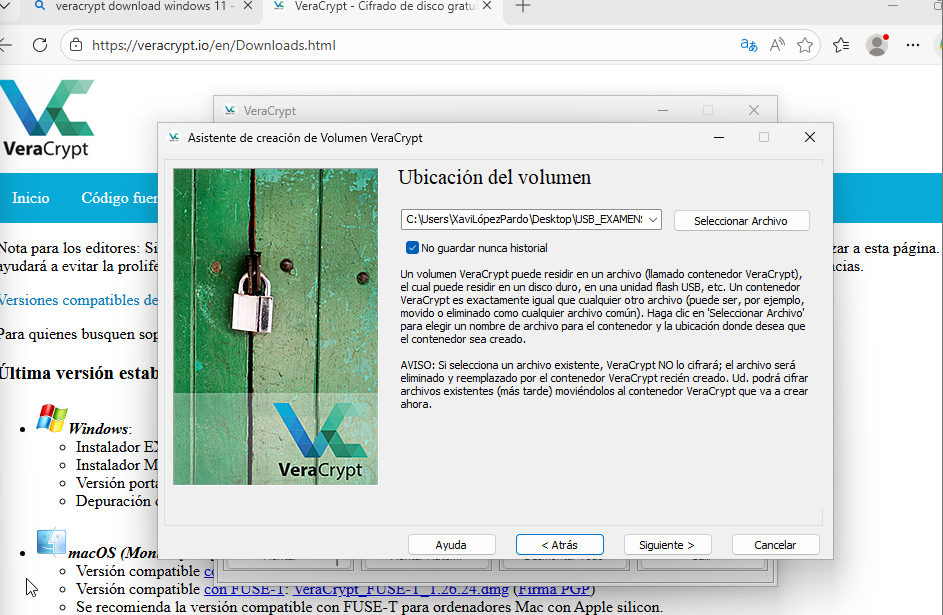
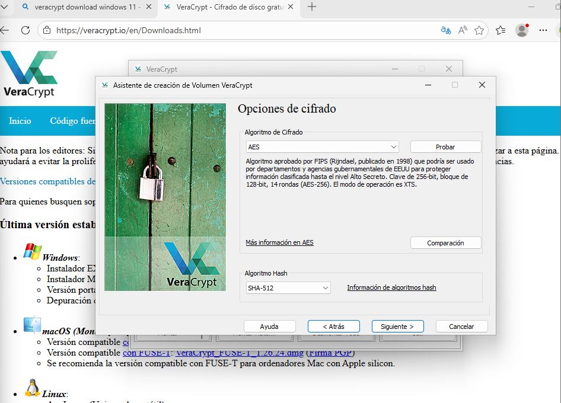
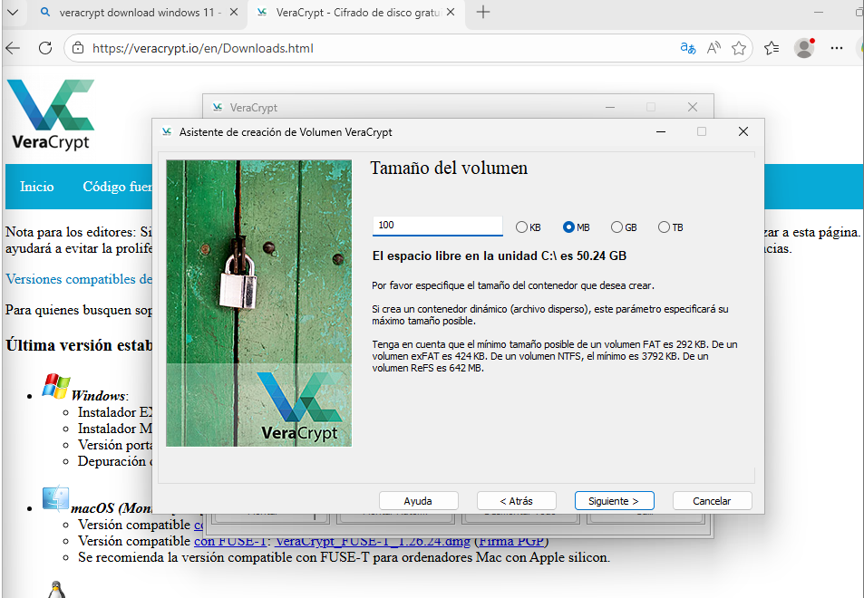
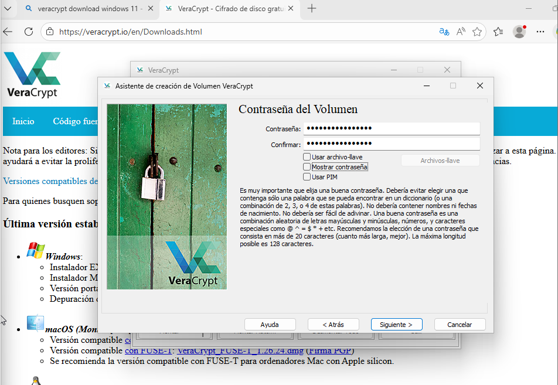
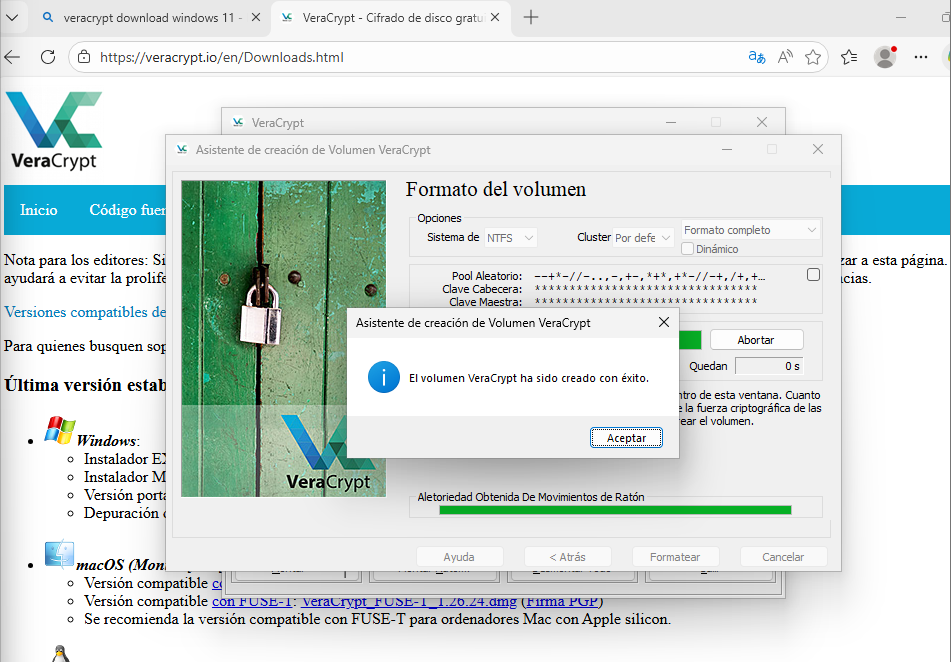
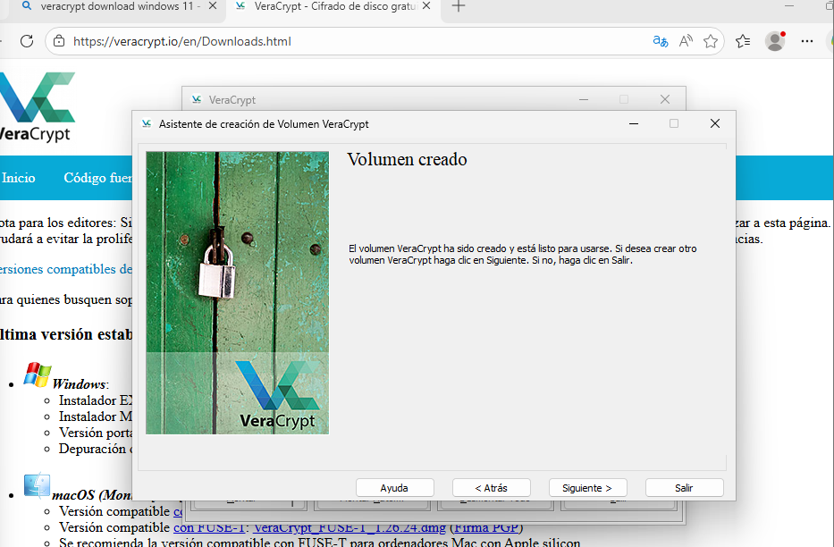

---

## 3.2 Muntatge del volum

El contenidor s’ha muntat correctament com una unitat virtual dins del sistema operatiu (exemple: unitat Z:), introduint la contrasenya establerta.

Un cop muntat, el sistema el reconeix com una unitat normal i permet guardar-hi arxius.

### 📸 Evidència 2 – Unitat muntada al sistema

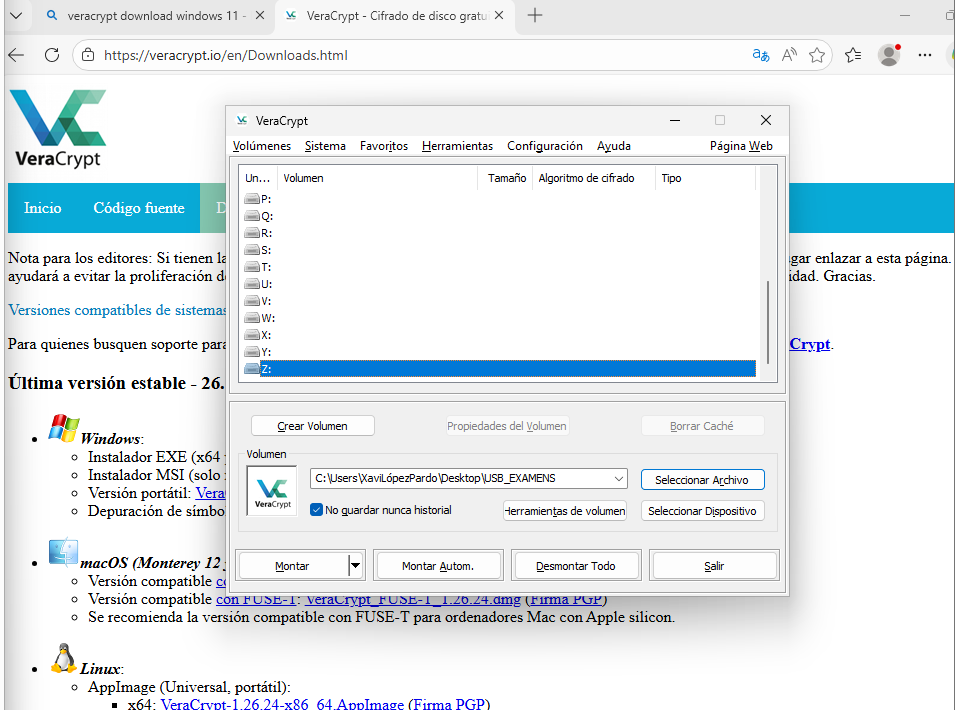
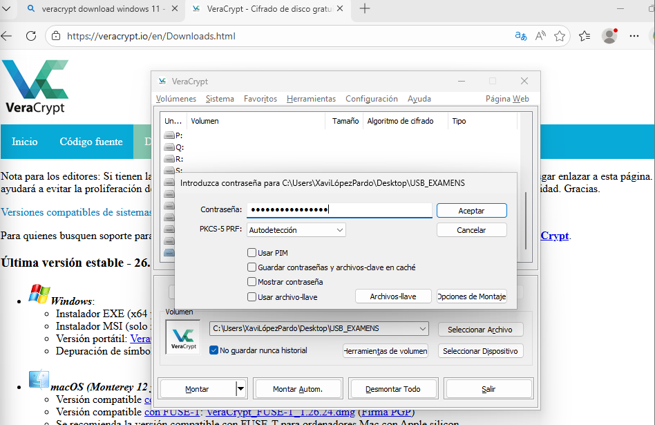
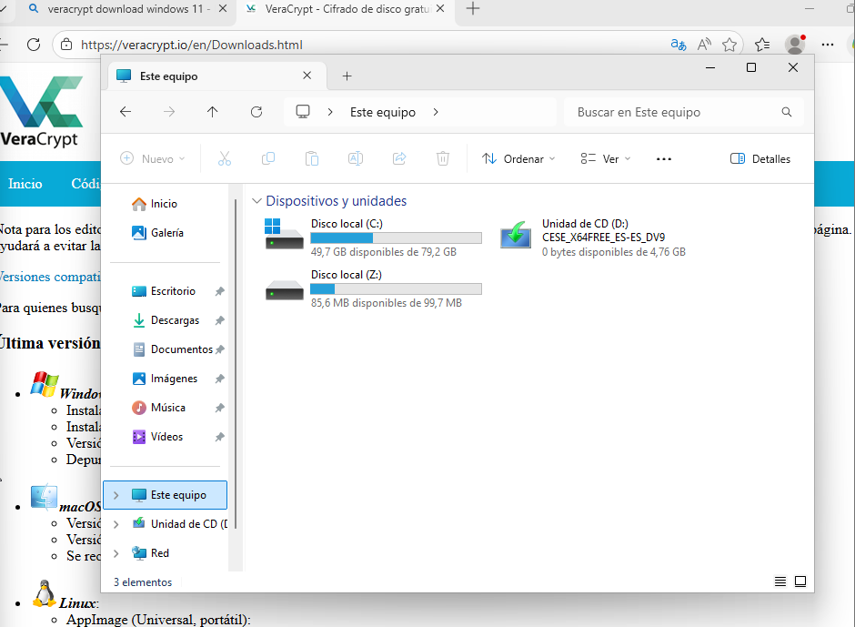
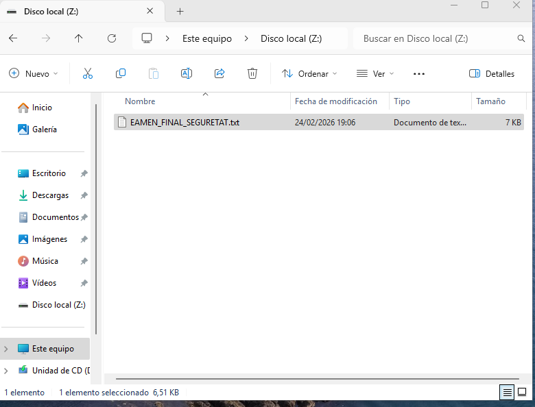
---

## 3.3 Creació del fitxer confidencial

Dins la unitat xifrada s’ha creat el fitxer:

EXAMEN_FINAL_SEGURETAT.txt

Aquest document conté preguntes d’examen de prova.

### 📸 Evidència 3 – Fitxer dins la unitat xifrada
_(Inserir captura on es vegi el fitxer dins la unitat muntada)_

---

## 3.4 Demostració d’inaccessibilitat

Després de desmuntar el volum:

- La unitat virtual desapareix del sistema.
- Si s’intenta obrir directament el fitxer contenidor, el contingut apareix amb caràcters il·legibles.

Això demostra que sense la contrasenya correcta no es pot accedir a la informació.

### 📸 Evidència 4 – Fitxer il·legible sense muntar
_(Inserir captura intentant obrir el fitxer contenidor directament)_

---

## 3.5 Resultat de la Tasca 1

La utilització del xifratge AES-256 garanteix la confidencialitat dels exàmens. En cas de pèrdua o robatori del dispositiu, la informació no pot ser llegida sense la contrasenya adequada.

---

# 4. TASCA 2 – Verificació d’Integritat (Hashing)

### Eina utilitzada: CertUtil (Windows 11)  
### Algorisme utilitzat: SHA-256  

---

## 4.1 Creació del document original

S’ha creat el fitxer:

nota_final_curs.txt

Amb el següent contingut:

L'alumne ha aprovat amb un 5

---

## 4.2 Càlcul del hash original

Mitjançant la comanda:

certutil -hashfile nota_final_curs.txt.txt SHA256

S’ha obtingut un valor hash únic que identifica el contingut del document.

---

## 4.3 Modificació del document

S’ha modificat una única xifra del document:

De:

L'alumne ha aprovat amb un 5

A:

L'alumne ha aprovat amb un 9

---

## 4.4 Nou càlcul del hash

Després de la modificació, s’ha tornat a executar la mateixa comanda per obtenir el nou hash.

El resultat obtingut és completament diferent del hash original, tot i haver canviat només un caràcter.

### 📸 Evidència 5 – Comparació dels dos hash
_(Inserir captura on es vegin els dos hash diferents al terminal)_

---

## 4.5 Resultat de la Tasca 2

La modificació d’un sol caràcter provoca un canvi total en el valor hash. Això demostra que qualsevol alteració és detectable i, per tant, es garanteix la integritat del document.

---

# 5. Conclusions i Recomanacions

A partir de les proves realitzades, es pot concloure que:

- El xifratge és imprescindible per protegir informació sensible en dispositius portables.
- Les contrasenyes han de ser llargues, complexes i no reutilitzades.
- És recomanable utilitzar gestors de contrasenyes per evitar pèrdues o filtracions.
- Els hash han de generar-se i conservar-se per verificar la integritat de documents importants com actes de notes, contractes o programari distribuït.

La combinació de xifratge (confidencialitat) i funcions hash (integritat) permet protegir adequadament la informació acadèmica de Projecte Nexus i reduir significativament el risc de filtracions o manipulacions.

---

# 6. Conclusió Final

La implementació de mesures com el xifratge AES-256 i l’ús de funcions hash SHA-256 demostra que és possible garantir la protecció de la informació sensible mitjançant eines accessibles i eficients.

Aquestes pràctiques són essencials per mantenir la seguretat, la confiança i la professionalitat en la gestió acadèmica.

