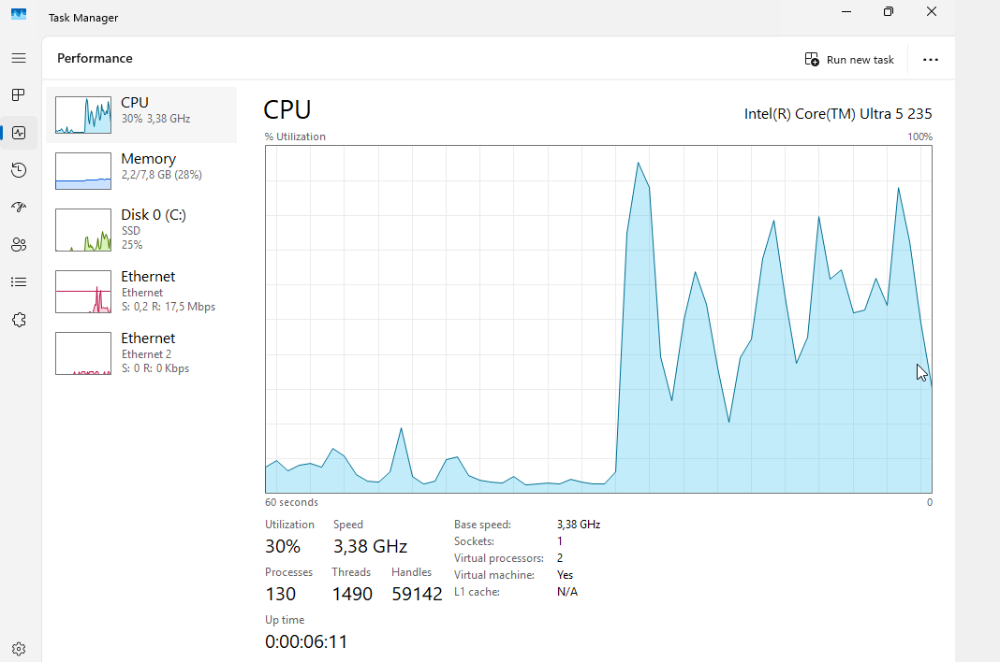
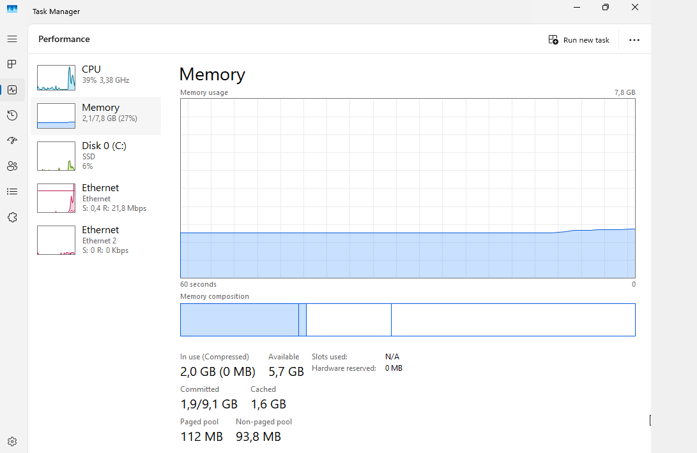
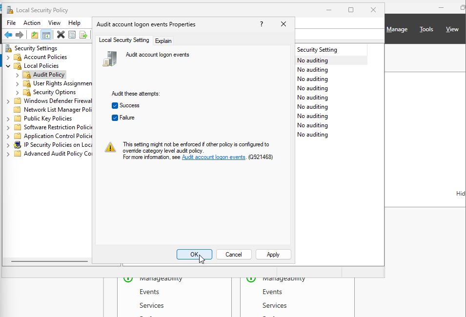
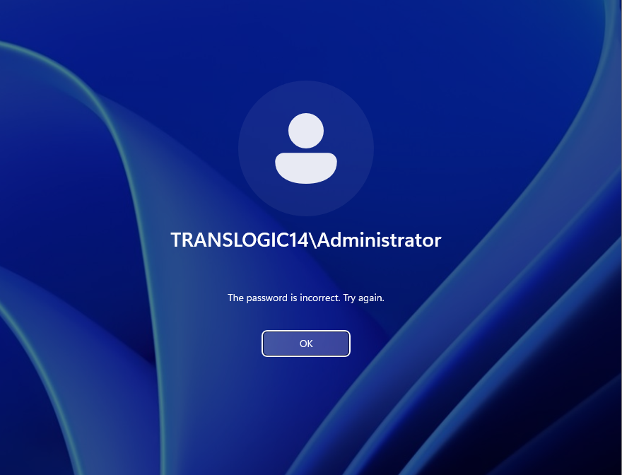
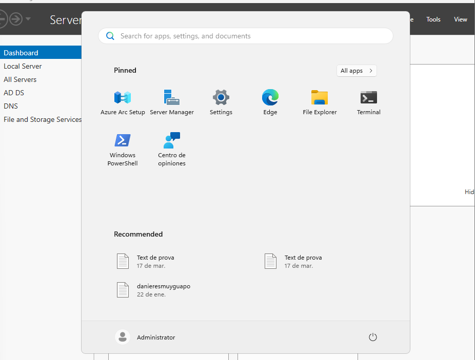
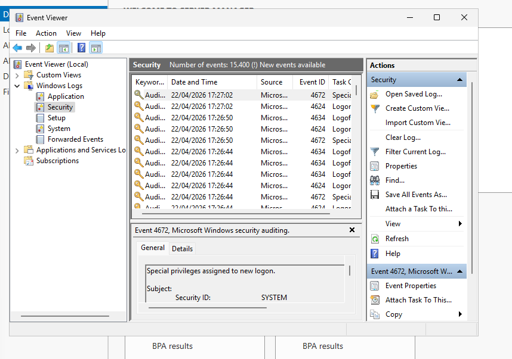
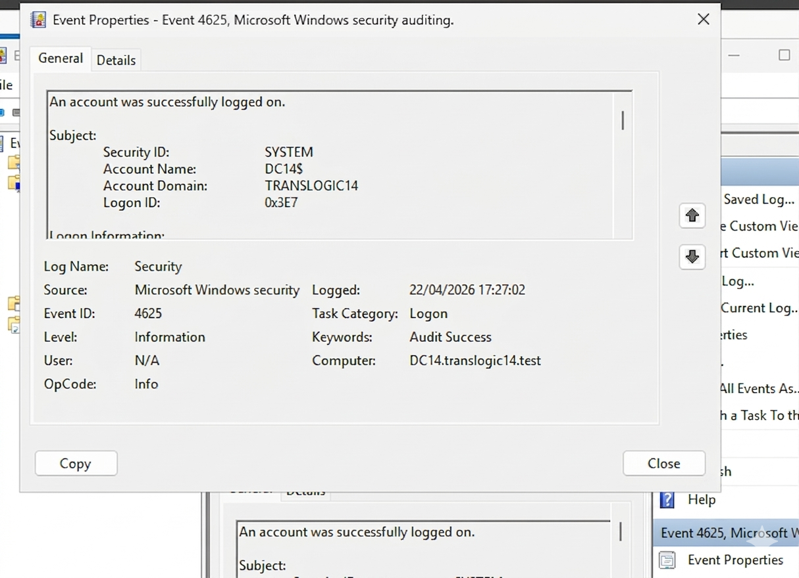
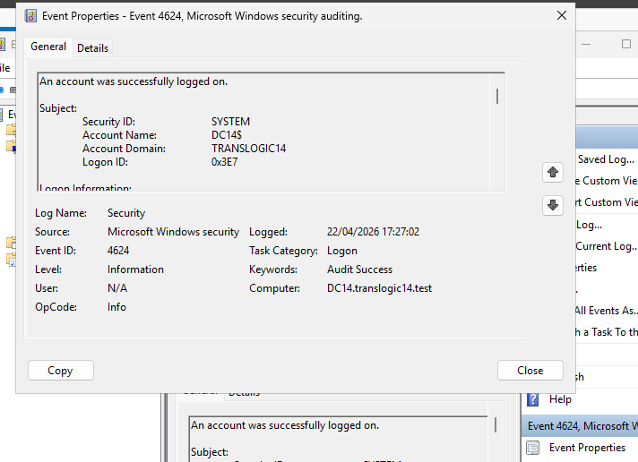

# 🛡️ Auditoria de Seguretat i Monitoratge a TransLògic S.A.

## Breu descripció
Amb la infraestructura operativa, la direcció vol blindar les dades tant com la mercaderia que mouen. Per tant, toca posar-hi ulls: verifiquem que el servidor no vagi ofegat de recursos, activem l'auditoria d'accessos, simulem un petit atac de força bruta i en recollim les proves al Visor d'Esdeveniments. Tot documentat perquè no hi hagi dubtes de qui intenta colar-se.

## Introducció
A TransLògic S.A. la informació és tan crítica com els enviaments físics. Un cop el servidor és en marxa, cal garantir que cap intrús fiqui el nas sense permís. En aquesta tasca fem tres coses clau:

- **Monitoritzar** CPU i RAM en temps real.
- **Configurar** l'auditoria d'inicis de sessió (èxits i fracassos).
- **Simular** intents fallits i **analitzar** les traces que deixa el sistema al registre de seguretat.

---

## 1. Monitorització de Recursos

Per comprovar que el servidor aguanta la càrrega actual, obrim el **Gestor de Tasques** a la pestanya *Rendimiento*.

A l'esquerra tenim el resum dels quatre recursos principals. A la dreta, el gràfic d'ús de CPU dels últims 60 segons.

Si volem més detall de la memòria, la pestanya *Memoria* ens mostra la composició completa.

Aquí veiem quanta RAM està realment en ús, quanta en caché i quanta queda lliure.

### 🔍 Anàlisi
- **CPU** al 30 % → el processador va folgat, ni s’immuta amb la feina actual.
- **Memòria** 2,2 GB usats de 7,8 GB (28 %) → quasi tres quarts de la RAM estan lliures. Cap símptoma de contenció.
- **Disc SSD** al 25 % d’activitat → lectures i escriptures residuals.
- **Xarxa** amb trànsit mínim (17,5 Mbps de baixada).

**Conclusió**: El servidor treballa completament **sense estrès**. Té recursos de sobres per a les aplicacions logístiques i per suportar pics puntuals de feina.

---

## 2. Configuració d’Auditoria de Seguretat

Per detectar atacs de força bruta, Windows ha de guardar cada intent d'inici de sessió, tant si és vàlid com si no.

Obrim la **Directiva de seguretat local** (`secpol.msc`) i anem a:  
*Directivas locales > Directiva de auditoría > Auditar inicio de sesión de cuenta*.

Marquem les caselles **Correcto** i **Incorrecto** i apliquem.

A partir d'ara, qualsevol intent d'entrar amb credencials bones o dolentes quedarà registrat al *Security* log de Windows, a punt per fer anàlisi forense.

---

## 3. Simulació d’Incidents (Hacking Ètic)

Ara fem el paper de “dolents controlats” per comprovar que l'auditoria funciona.

1. Tanquem la sessió.
2. Intentem iniciar sessió amb l'usuari **Administrator** però posant la contrasenya **malament** expressament 3 o 4 cops.
3. El sistema ens mostra el missatge d'error.

4. Finalment, introduïm la contrasenya correcta i entrem a l'escriptori amb l'administrador.

Aquests passos generaran diversos esdeveniments de seguretat: uns de fallits (4625) i un d'èxit (4624). Ara toca caçar-los.

---

## 4. Anàlisi Forense – Event Viewer

Obim el **Visor d'esdeveniments** (`eventvwr.msc`) i anem a *Registros de Windows > Seguridad*.

Al centre apareix el llistat d'esdeveniments recents. Aquí podem veure una barreja d'**Event ID 4624** (inici correcte) i diversos **4625** (intents fallits un darrere l'altre).

<!-- Si aconsegueixes la captura 6 (la vista de la llista), la pots inserir aquí -->

*Si tens la captura amb la llista d'esdeveniments, posa-la aquí. Si no, pots eliminar aquesta línia i la imatge.*

Seleccionem un dels errors (4625) i fem doble clic per veure'n els detalls: data, hora, compte que ha fallat, equip origen...

També podem contrastar-ho amb un inici d'èxit (4624), tot i que l'important per a l'evidència de l'intent d'intrusió és el 4625.

### 🕵️ Tasca d'investigació

L'**Event ID** que Windows assigna a un intent d'inici de sessió fallit és el **4625**.  
Una ràfega de 4625 seguits per al mateix usuari és un indici clar d'un possible atac de força bruta. Amb l'auditoria activada, tenim la prova al registre.

---

## 🧾 Què cal lliurar (resum)

- ✅ Captura del Gestor de Tasques amb l'anàlisi (CPU 30 %, RAM 28 % → sense estrès).
- ✅ Captura de la directiva d'auditoria d'inici de sessió (Success i Failure activats).
- ✅ Evidència forense: captura d'un esdeveniment **4625** al Visor d'Esdeveniments amb els seus detalls.
- ✅ Resposta tècnica: **Event ID = 4625**.

---

*Guia llesta per al teu GitHub. Les imatges van a la carpeta `img/` amb els noms tal qual: `1.png`, `2.png`, `3.png`, `4.png`, `5.png`, `6.png` (si la tens), `7.png`, `8.png`.*
